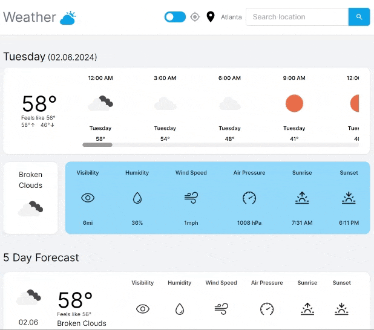
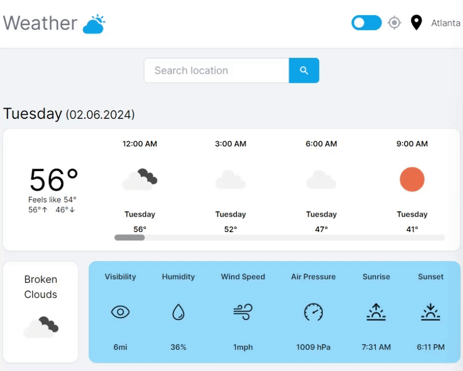
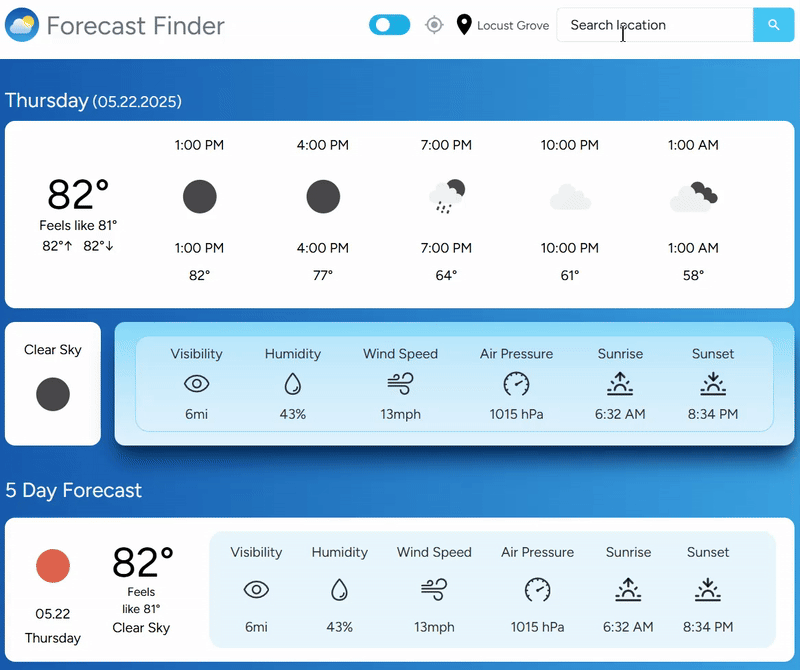
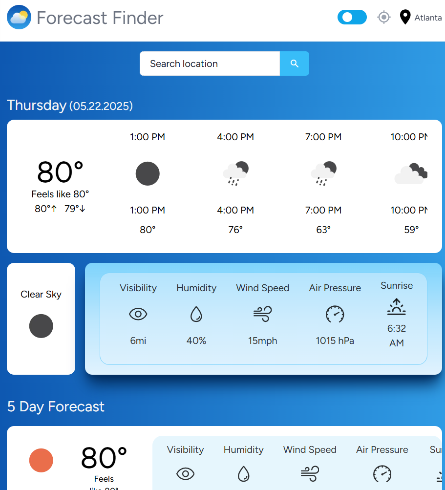
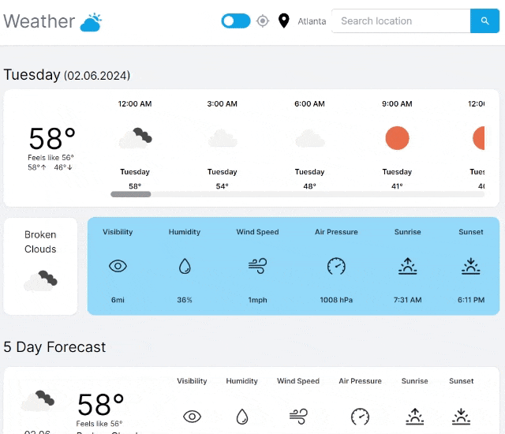
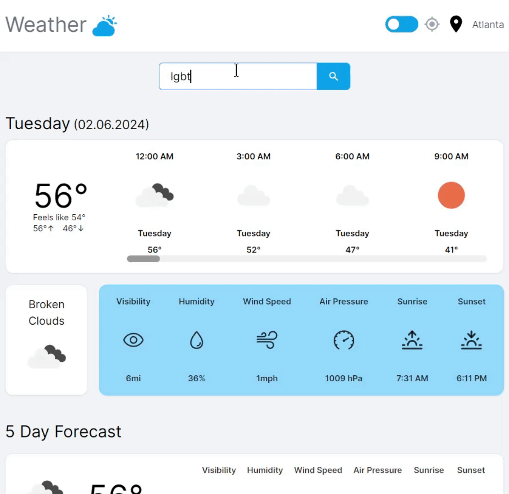
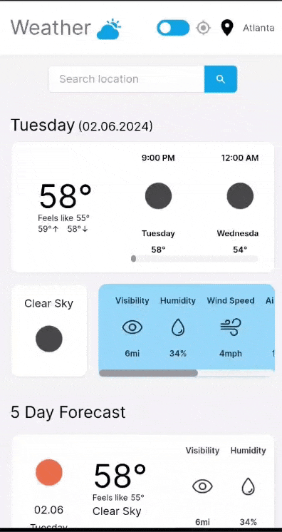

<h1 align='center'>Weather App 
Live Site: https://weather-app-murex-gamma.vercel.app/
</h1>

## Description

A Next.js app that displays weather data based on the selected location. Built with <strong>Next.js</strong>, <strong>React</strong>, <strong>TypeScript</strong>, <strong>React hooks</strong>, <strong>Tailwind CSS</strong>, <strong>Axios</strong>, <strong>Jotai</strong>, <strong>Date-fns</strong>, <strong>Clsx</strong>, <strong>Tanstack/react-query</strong>, <strong>OpenWeatherMap API</strong>, and deployed on <strong>Vercel</strong>

I also added a dark mode toggle feature with custom stylings for dark mode vs light mode

## Features
<li>Location icon detects user's location
</li>
 

<li>Search box allows user to search for location and "Enter" key will submit
</li>
 

<li>Responsive layout using CSS Flexbox
</li>
 

<li>Skeleton app loads when requesting new data
</li>
 

<li>Dark mode vs light mode toggle option
</li>
 

<li>Error message displays if location is not found
</li>
 

<li>Mobile-friendly design to ensure seamless user interactions across devices
</li>
 
 
<li>Footer that contains link to GitHub source code
</li>
 
 
<li>Custom site favicon
</li>
 

## Possible Future Improvements:
<li>Time zone updates depending on location selected</li>
<li>Letting user control whether measurements are metric or imperial</li>
