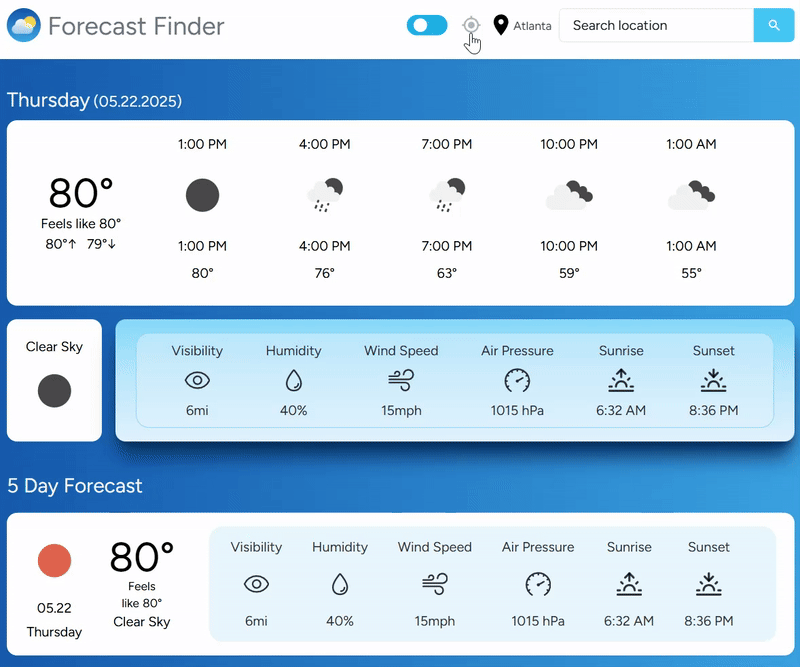
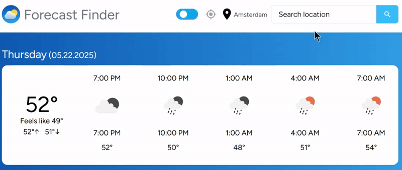

<h1 align='center'>Forecast Finder 
Live Site: https://weather-app-murex-gamma.vercel.app/
</h1>

This is based off of a FreeCodeCamp tutorial but I've added some improvements!

## Description

A Next.js app that displays weather data based on the selected location. Built with <strong>Next.js</strong>, <strong>React</strong>, <strong>TypeScript</strong>, <strong>React hooks</strong>, <strong>Tailwind CSS</strong>, <strong>Axios</strong>, <strong>Jotai</strong>, <strong>Date-fns</strong>, <strong>Clsx</strong>, <strong>Tanstack/react-query</strong>, <strong>OpenWeatherMap API</strong>, and deployed on <strong>Vercel</strong>

I also added a dark mode toggle feature with custom stylings for dark mode vs light mode.

Possible Future Improvements:

<li>Letting user control whether measurements are metric or imperial</li>

## Features
<li>Location icon detects user's location
</li>
 

<li>Search box allows user to search for location and "Enter" key will submit
</li>
 

<li>Responsive layout using Flexbox
</li>
 

<li>Skeleton app loads when requesting new data
</li>
 

<li>Dark mode toggle option
</li>
 

<li>Error Message
</li>
 

<li>Mobile-friendly
</li>
 
 
<li>Footer that contains link to GitHub source code
</li>
 
 
<li>Custom site favicon
</li>
 

